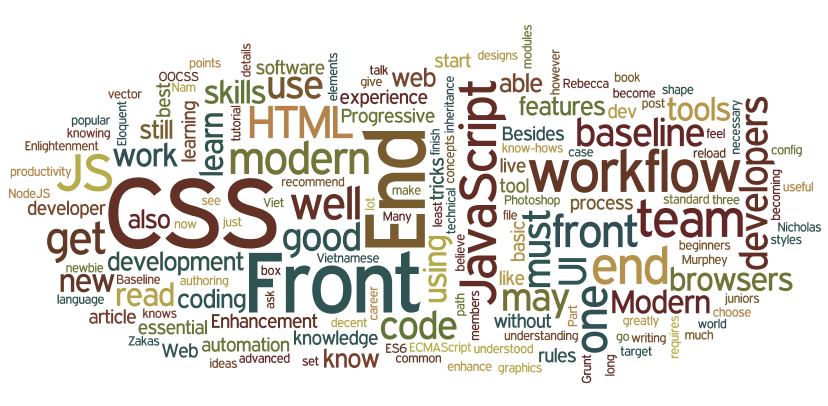

# Front-end dev skills

<cite>image source: <a href="http://blog.naustud.io/2015/06/baseline-for-modern-front-end-developers.html">http://blog.naustud.io/2015/06/baseline-for-modern-front-end-developers.html</a></cite>

Basic to advanced HTML, CSS, DOM, JavaScript, HTTP/URL, and browser skills are assumed for any type of front-end developer. 

Beyond HTML, CSS, DOM, JavaScript, HTTP/URL, and browser development, a front-end developer could be skilled in one or more of the following:

* Content management systems (aka CMS)
* Node.js
* Cross-browser testing
* Cross-platform testing
* Unit Testing
* Cross-device testing
* Accessibility / WAI-ARIA
* Search Engine Optimization (aka SEO)
* Interaction or User Interface design
* User Experience
* Usability
* E-commerce Systems
* Portal Systems
* Wireframing
* CSS layout / Grids
* DOM manipulation (e.g. jQuery)
* Mobile Web Performance
* Load Testing
* Performance Testing
* Progressive Enhancement / Graceful Degradation
* Version Control (e.g. GIT)
* MVC / MVVM / MV* 
* Functional Programming
* Data Formats (e.g. JSON, XML)
* Data API's (e.g Restful API)
* Web Font Embedding
* Scalable Vector Graphics (aka SVG)
* Regular Expressions
* Content Strategy
* Microdata / Microformats
* Task Runners, Build Tools, Process Automation Tools
* Responsive Web Design
* Object Oriented Programming
* Application Architecture
* Modules
* Dependency Managers
* Package Managers
* JavaScript Animation
* CSS Animation
* Charts / Graphs
* UI widgets
* Code Quality Testing
* Code Coverage Testing
* Code Complexity Analysis
* Integration Testing
* Command Line / CLI 
* Templating Strategies
* Templating Engines
* Single Page Applications
* XHR Requests (aka AJAX)
* Web/Browser Security
* HTML Semantics
* Browser Developer Tools

